```mermaid
graph TB
    subgraph "🏢 MARKETPLACE MONITOR HEADQUARTERS"
        
        subgraph "GROUND FLOOR - Reception & Security"
            FE[🖥️ Frontend Lobby<br/>Next.js Application<br/>User Interface]
            LB[🚪 Load Balancer<br/>Nginx/Cloudflare<br/>Traffic Director]
        end
        
        subgraph "1ST FLOOR - Customer Service"
            API[📞 API Department<br/>FastAPI<br/>REST Endpoints]
            AUTH[🔐 Security Desk<br/>JWT Authentication<br/>Password Verification]
            CORS[🚧 Access Control<br/>CORS Middleware<br/>Request Validation]
        end
        
        subgraph "2ND FLOOR - Operations Center"
            USERS[👥 User Relations<br/>User Management<br/>Profile & Stats]
            SEARCH[🔍 Search Planning<br/>Search Config CRUD<br/>Pause/Resume]
            LISTING[📋 Listings Archive<br/>Listing Management<br/>Save/Hide/View]
            TEMPLATE[📚 Template Library<br/>Pre-made Searches<br/>Featured Templates]
        end
        
        subgraph "3RD FLOOR - Data Center"
            DB[(🗄️ Main Vault<br/>PostgreSQL<br/>User Data, Searches,<br/>Listings, Alerts)]
            REDIS[⚡ Speed Cache<br/>Redis<br/>Session Storage<br/>Message Queue]
        end
        
        subgraph "BASEMENT - Power Plant & Workers"
            CELERY[⚙️ Task Coordinator<br/>Celery Beat<br/>Job Scheduler]
            WORKER1[👷 Monitor Team<br/>Celery Workers<br/>Marketplace Polling]
            WORKER2[📮 Alert Team<br/>Celery Workers<br/>Send Notifications]
        end
        
        subgraph "ROOFTOP - Communications"
            EBAY[🏪 eBay Antenna<br/>Finding API<br/>Search & Fetch]
            FB[📘 Facebook Tower<br/>Marketplace<br/>Scraping]
            GUMTREE[🌳 Gumtree Signal<br/>UK Listings<br/>Scraping]
            CL[📰 Craigslist Feed<br/>Classifieds<br/>Scraping]
        end
        
        subgraph "EXTERNAL SERVICES - City Infrastructure"
            EMAIL[📧 Post Office<br/>SendGrid<br/>Email Delivery]
            SMS[📱 Telecom Tower<br/>Twilio<br/>SMS Gateway]
            STRIPE[💳 Bank<br/>Stripe<br/>Payments]
            WEBHOOK[🔗 Courier Service<br/>HTTP Webhooks<br/>Custom Integrations]
        end
    end
    
    %% User Flow
    USER[👤 Users<br/>Buyers & Sellers] --> FE
    FE --> LB
    LB --> API
    
    %% API Layer Connections
    API --> AUTH
    API --> CORS
    AUTH --> USERS
    AUTH --> SEARCH
    AUTH --> LISTING
    AUTH --> TEMPLATE
    
    %% Data Layer
    USERS --> DB
    SEARCH --> DB
    LISTING --> DB
    TEMPLATE --> DB
    
    USERS --> REDIS
    SEARCH --> REDIS
    
    %% Worker Connections
    CELERY --> REDIS
    CELERY --> WORKER1
    CELERY --> WORKER2
    
    WORKER1 --> DB
    WORKER2 --> DB
    
    %% Marketplace Connections
    WORKER1 --> EBAY
    WORKER1 --> FB
    WORKER1 --> GUMTREE
    WORKER1 --> CL
    
    %% Alert Connections
    WORKER2 --> EMAIL
    WORKER2 --> SMS
    WORKER2 --> WEBHOOK
    
    %% Payment Flow
    API --> STRIPE
    STRIPE -.Webhooks.-> API
    
    %% Data Flow Arrows
    EBAY -.New Listings.-> WORKER1
    FB -.New Listings.-> WORKER1
    GUMTREE -.New Listings.-> WORKER1
    CL -.New Listings.-> WORKER1
    
    WORKER1 -.Store.-> DB
    DB -.Trigger.-> WORKER2
    
    %% Styling
    classDef frontend fill:#60a5fa,stroke:#2563eb,stroke-width:3px,color:#fff
    classDef api fill:#34d399,stroke:#059669,stroke-width:3px,color:#fff
    classDef data fill:#fbbf24,stroke:#d97706,stroke-width:3px,color:#000
    classDef worker fill:#f87171,stroke:#dc2626,stroke-width:3px,color:#fff
    classDef external fill:#a78bfa,stroke:#7c3aed,stroke-width:3px,color:#fff
    classDef marketplace fill:#fb923c,stroke:#ea580c,stroke-width:3px,color:#fff
    
    class FE,LB frontend
    class API,AUTH,CORS,USERS,SEARCH,LISTING,TEMPLATE api
    class DB,REDIS data
    class CELERY,WORKER1,WORKER2 worker
    class EMAIL,SMS,STRIPE,WEBHOOK external
    class EBAY,FB,GUMTREE,CL marketplace
```

## 🏢 Architecture Explanation - The Office Building

### **Ground Floor - Reception & Security**
The main entrance where all visitors (users) arrive. The load balancer acts as the receptionist, directing traffic to the right department.

### **1st Floor - Customer Service**
The API department handles all customer requests. Security desk (JWT Auth) checks credentials, and access control ensures only authorized personnel can access certain areas.

### **2nd Floor - Operations Center**
Different departments handling different aspects of the business:
- **User Relations**: Manages customer accounts
- **Search Planning**: Helps customers set up what they're looking for
- **Listings Archive**: Maintains records of all findings
- **Template Library**: Pre-made solutions for common needs

### **3rd Floor - Data Center**
The company's vault where all information is stored:
- **PostgreSQL**: Main filing system with structured data
- **Redis**: Quick-access cache for frequently needed information

### **Basement - Power Plant & Workers**
The engine room where the real work happens:
- **Celery Beat**: The shift supervisor scheduling all tasks
- **Monitor Team**: Workers constantly checking marketplaces
- **Alert Team**: Workers sending out notifications

### **Rooftop - Communications**
Antennas and satellite dishes connecting to external marketplaces:
- **eBay Antenna**: Official connection via API
- **Facebook, Gumtree, Craigslist**: Alternative connections via scraping

### **External Services - City Infrastructure**
Outside services the building connects to:
- **Post Office (SendGrid)**: Delivers emails
- **Telecom (Twilio)**: Sends text messages
- **Bank (Stripe)**: Processes payments
- **Courier (Webhooks)**: Custom delivery service

## 📊 Data Flow Through The Building

1. **👤 User enters** the building (Frontend Lobby)
2. **🚪 Receptionist** directs them to the right floor (Load Balancer)
3. **🔐 Security checks** their credentials (JWT Auth)
4. **📞 Customer service** handles their request (API Endpoints)
5. **👥 User Relations** accesses their profile (Database)
6. **🔍 Search Planning** sets up their monitoring (Create Search)
7. **⚙️ Task Coordinator** schedules the work (Celery Beat)
8. **👷 Monitor Team** checks marketplaces every 5 minutes (Workers)
9. **🏪 Rooftop antennas** fetch data from eBay, Facebook, etc.
10. **📋 Listings Archive** stores new findings (Database)
11. **📮 Alert Team** sends notifications (Email/SMS Workers)
12. **📧 Post Office** delivers the message to the user

## 🔄 The Daily Cycle

**Every 5 Minutes:**
- Shift supervisor (Celery Beat) assigns tasks
- Monitor teams check all active searches
- New listings are filed in the archive
- Alert teams notify users immediately

**24/7 Operations:**
- Security always checking credentials
- Data center always accessible
- Workers always ready for tasks
- Communications always open to marketplaces

This architecture ensures:
- **Scalability**: Add more workers as needed (hire more staff)
- **Reliability**: If one worker fails, others continue (redundancy)
- **Separation**: Each floor handles its own concerns (modularity)
- **Efficiency**: Redis cache for quick access (speed)
- **Maintainability**: Clear structure (easy to navigate)
